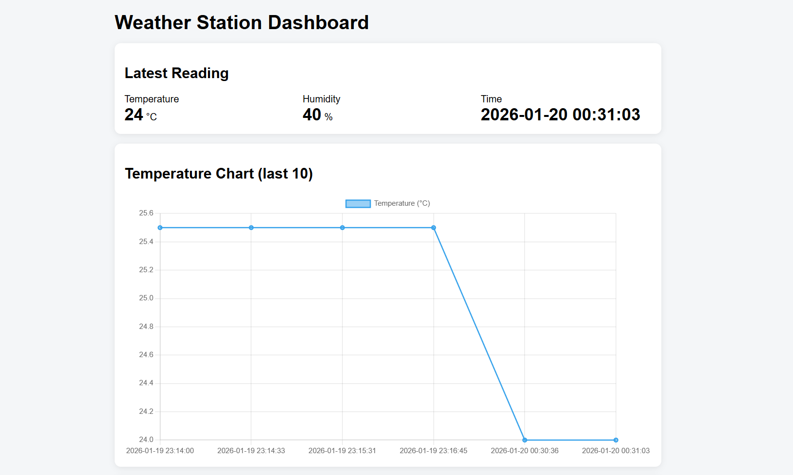
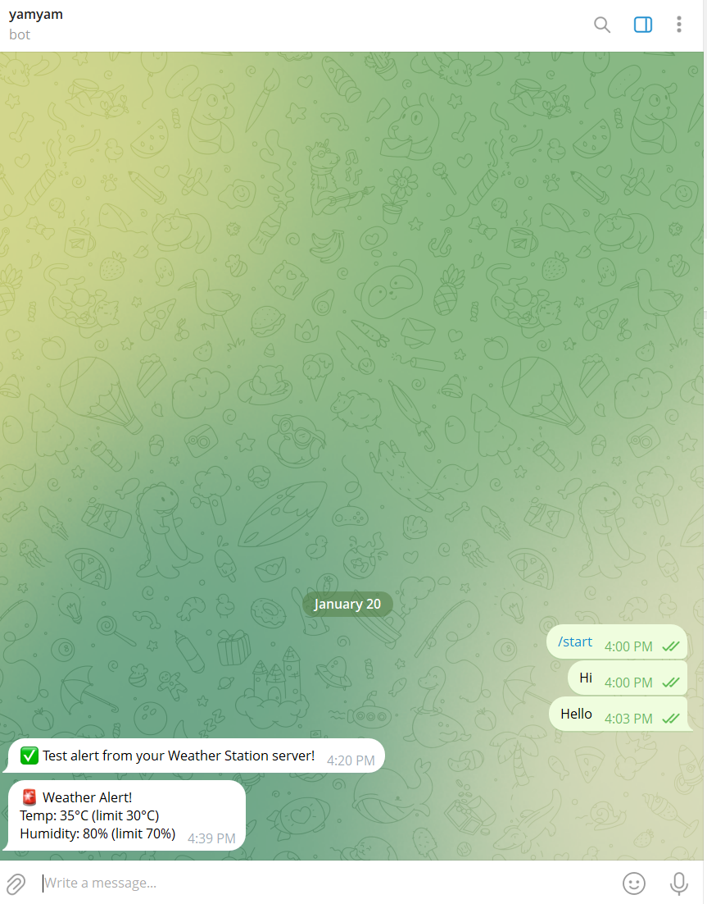
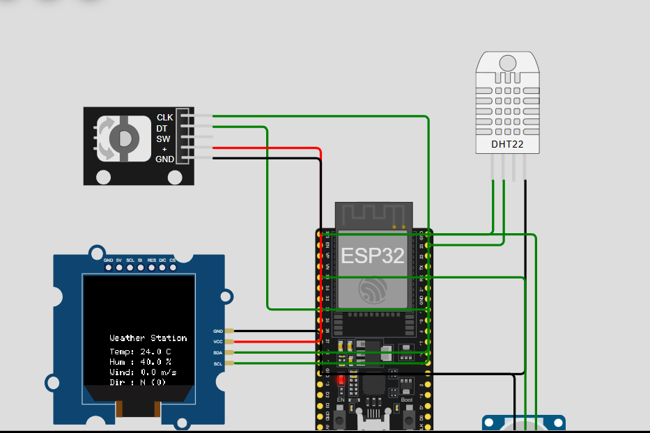

#  ESP32 Weather Station

A simple IoT weather station project built with *ESP32*, *Node.js*, *SQLite*, and a *web dashboard*.  
It also sends *Telegram alerts* when temperature or humidity is too high.

---

# What this project does

- ESP32 reads *temperature and humidity*
- Data is sent to a server using *WiFi (HTTP + JSON)*
- Server saves data in *SQLite database*
- Web dashboard shows live data and charts
- *Telegram alert is sent automatically* when limits are crossed

---

# How it works
ESP32 → Server → Database
↑
Web Dashboard
↓
Telegram Alerts

---

#  Features

- Live temperature and humidity
- Data stored permanently
- Web dashboard (table + chart)
- Updates every 5 seconds
- Telegram alert when:
  - Temperature ≥ 30°C
  - Humidity ≥ 70%
- Alert cooldown to avoid spam

---

# Technologies Used

- ESP32
- Arduino (C++)
- Node.js + Express
- SQLite
- HTML, CSS, JavaScript
- Chart.js
- Telegram Bot API
- Cloudflare Tunnel

---
# Wokwi Simulation

The ESP32 weather station can be simulated using Wokwi.

Files:
- `wokwi/diagram.json` – circuit wiring
- `wokwi/sketch.ino` – ESP32 code
- `wokwi/libraries.txt` – required libraries

# Project Results

# Web Dashboard

# Telegram Alert

# Wokwi Simulation

# last Alert
!
[Last Alert](screenshots/last-reading.png)

# Project Structure
Weather station project/
├── server.js
├── weather-frontend/
├── wokwi/
├── screenshots/
│   ├── dashboard.png
│   ├── telegram-alert.png
│   └── wokwi-simulation.png
└── README.md

[def]: screenshots/last-alart.png