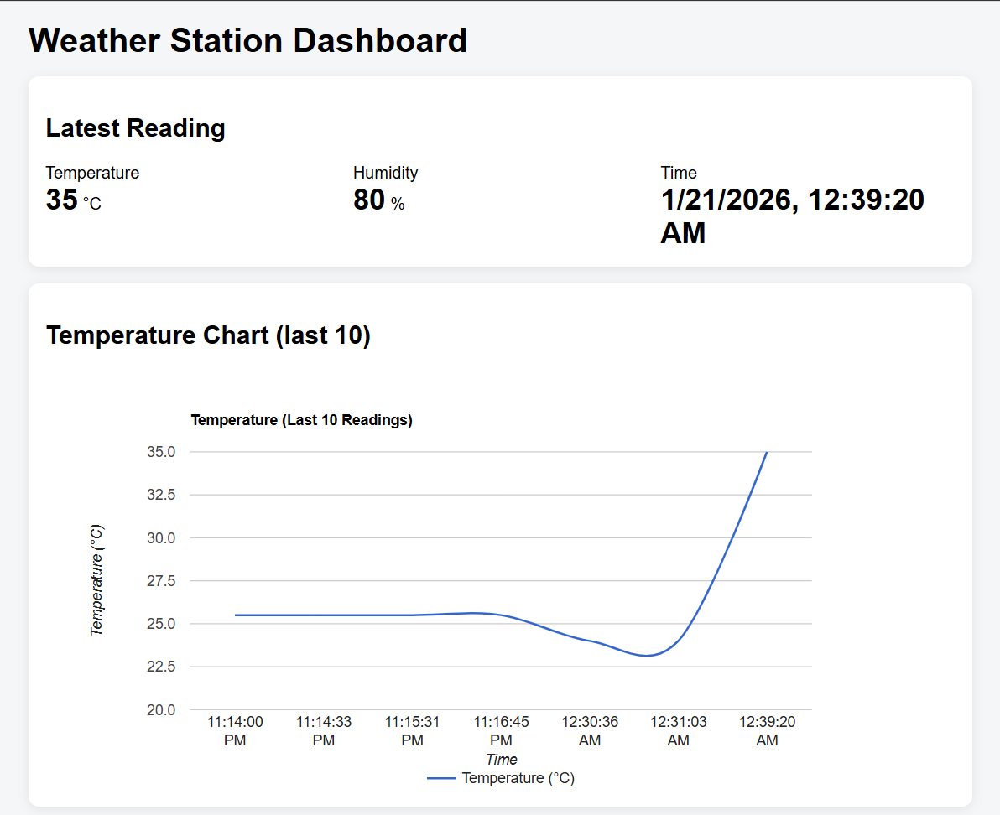
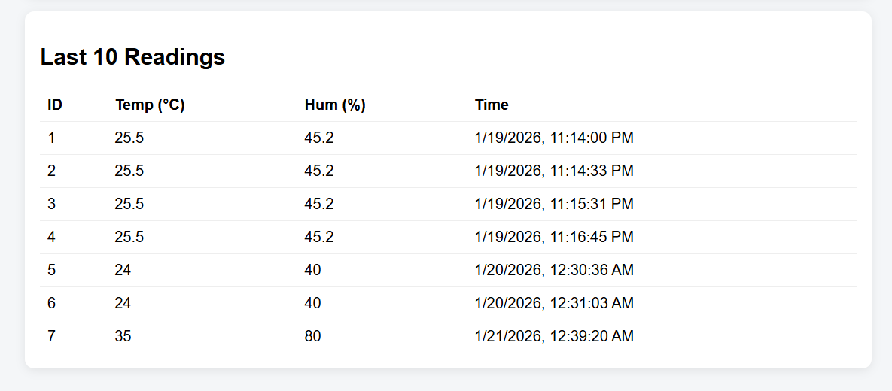
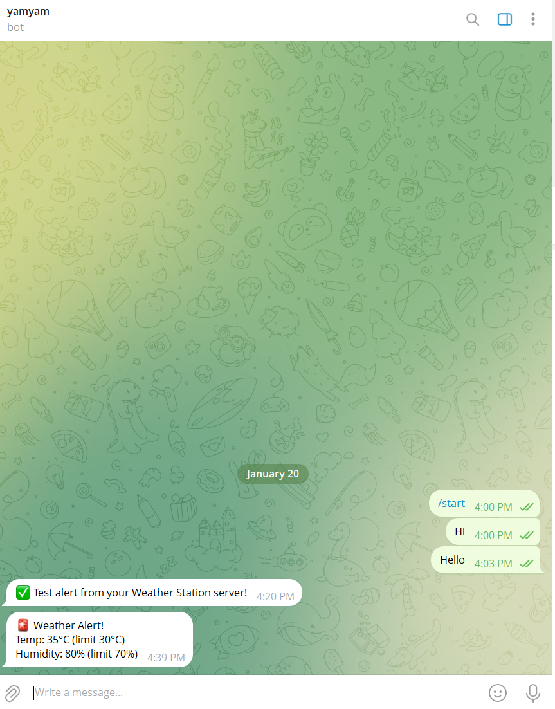
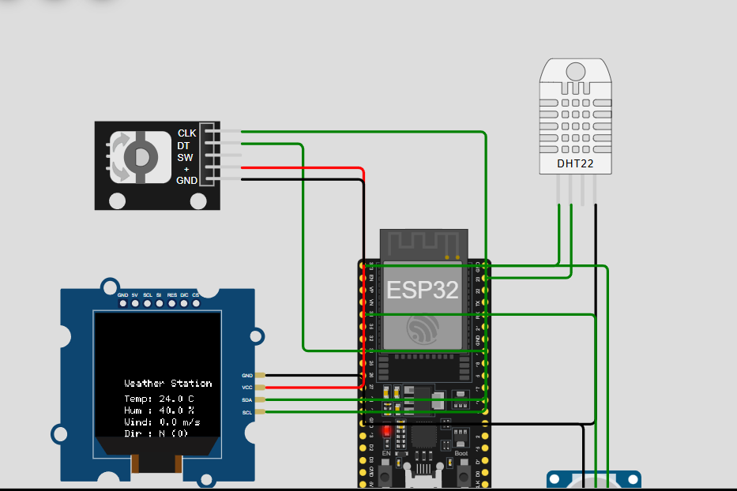

 ESP32 Weather Station Project

This is my IoT Weather Station project built using ESP32, Node.js, SQLite, and a web dashboard with Google Charts.

The system reads temperature and humidity from a DHT22 sensor, stores the data in a database, shows it on a live dashboard, and sends Telegram alerts if values go above a limit.

 What This Project Does

Reads temperature & humidity from ESP32 (DHT22)

Sends data to a Node.js backend

Stores readings in SQLite database

Shows live data on a web dashboard

Displays temperature trend using Google Charts

Sends Telegram alert when temperature or humidity is too high

Can be accessed publicly using Cloudflare Tunnel

 How It Works
ESP32 (DHT22 Sensor)
        ↓
Node.js API (Express)
        ↓
SQLite Database
        ↓
Web Dashboard
        ↓
Telegram Alerts

The ESP32 sends data using HTTP POST request to the backend.
The backend stores it and the frontend fetches the latest data every 5 seconds.

 Technologies Used
Hardware

ESP32

DHT22 Sensor

Wokwi (for simulation)

Backend

Node.js

Express

SQLite3

node-fetch

CORS

Frontend

HTML

CSS

JavaScript

Google Charts

Networking

Cloudflare Quick Tunnel

 Project Structure
weather-station-project/
│
├── server.js
├── weather.db
├── package.json
│
├── weather-frontend/
│   ├── index.html
│   └── app.js
│
├── Wokwi/
│   ├── sketch.ino
│   └── diagram.json
│
└── wiring-and-result/
 How to Run the Project
1. Install Dependencies
npm install
2. Start Backend Server
node server.js

Server runs on:

http://localhost:3001
3. (Optional) Run Cloudflare Tunnel

If you want public access:

cloudflared tunnel --url http://localhost:3001

Then update this in weather-frontend/app.js:

const BASE_URL = "https://my***-tunnel-url.trycloudflare.com";
4. Open Dashboard

Open:

weather-frontend/index.html

The dashboard refreshes automatically every 5 seconds.

API Endpoints
Get Latest Reading
GET /api/readings/latest

Example:

{
  "id": 7,
  "temperature": 35,
  "humidity": 80,
  "created_at": "2026-01-21 00:39:20"
}
Get Last 10 Readings
GET /api/readings/history
Send New Reading (from ESP32)
POST /api/readings

Body example:

{
  "temperature": 25.5,
  "humidity": 45.2
}
Alert System

The system sends a Telegram message when:

Temperature ≥ 30°C

Humidity ≥ 70%

There is a 60-second cooldown between alerts to avoid spam.

 Dashboard Features

Shows latest reading

Shows last 10 readings in table

Displays temperature trend chart

Auto updates every 5 seconds

Works locally or via Cloudflare tunnel

Project Results

 Dashboard View

  

Last 10 Readings Table

  

Telegram Alert

  

Wokwi Simulation

  

What I Learned

From this project I learned:

How to connect ESP32 with a backend server

How to build REST APIs using Express

How to use SQLite database

How to create a live updating dashboard

How to use Google Charts

How to expose local server using Cloudflare tunnel

How to implement alert systems

 Author

Shoshe Asanin
ESP32 Weather Station Project
2026